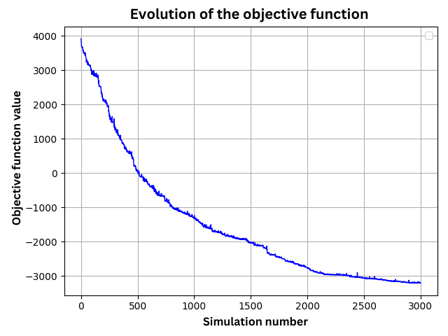
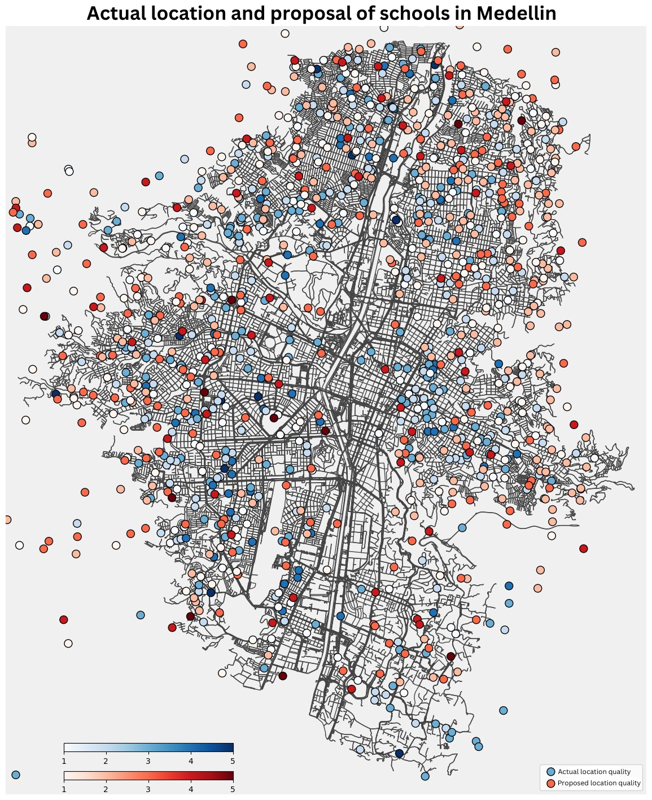

# Optimal School Locations in Medellín

## Overview
This project explores the application of Linear Optimization to address the capacitated P-median problem, aimed at identifying the optimal distribution of schools in Medellín, Colombia. By using **Simulated Annealing (SA)** and clustering techniques, the project evaluates whether the current distribution of schools is optimal in terms of socioeconomic and quality metrics.

## Objectives
- Minimize the total weighted distance between students' residences and schools, considering:
  - Socioeconomic strata of neighborhoods.
  - Quality ratings of schools.
- Propose a new school distribution and compare it to the existing one.
- Provide insights for urban planning and infrastructure investment in education.

## Key Features
- **Linear Optimization Model:** Mixed Integer Linear Programming (MILP) formulation.
- **Algorithm:** Implementation of the Simulated Annealing metaheuristic.
- **Data-Driven Approach:**
  - Geospatial data of Medellín's neighborhoods and schools.
  - Integration of socioeconomic strata and school quality metrics.

## Tools and Libraries
- **Programming Language:** Python
- **Libraries:** 
  - `geopandas`, `pandas`, `numpy` for data manipulation and geospatial analysis.
  - `pulp` for optimization modeling.
  - `sklearn` for clustering (K-means).
- **Optimization Solver:** Gurobi

## Methodology
1. **Data Collection and Preprocessing:**
   - Neighborhood and school data from official sources.
   - Generation of synthetic data points for optimization.
2. **Model Development:**
   - Definition of the MILP problem with constraints.
   - Implementation of the Simulated Annealing algorithm.
3. **Execution:**
   - Iterative simulation to improve the school distribution.
   - Comparison with the real-world school distribution.
4. **Results:**
   - A proposed configuration with a 3% improvement over the current weighted distance.

## Results
The project demonstrated that the current school distribution in Medellín is not the best. Our proposed model offers a viable alternative, reducing the total weighted distance between students and schools.

### Objective Function Evolution
Below is a graph showing the evolution of the objective function during the optimization process:

  

### Proposed School Locations
The following graph illustrates the proposed locations for schools, compared to their current distribution:

  

## Collaborators

- [Camilo Bermúdez](https://www.github.com/camilobdez)
- [Luis Baena](https://www.github.com/alejobaenam)
- [Jesús Cantellón](https://www.github.com/JDavidCE2022)
